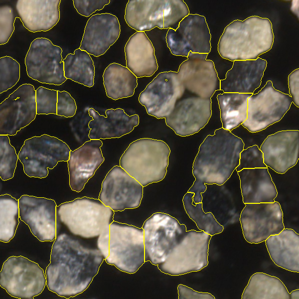

# 8INF804 Traitement Numérique des Images : TP n°2 "Segmentation d'une image"

## Description
Ce projet a pour objectif la segmentation de différentes images d'échantillons de roches afin d'identifier un à un les grains et calculer la moyenne de chacun des channels BGR du grain pour déterminer le type de minéral correpondant.

## Utilisation (sous windows)
- Rendez-vous dans le répertoire principal : `cd ./tp2_8inf804`
- En utilisant notre environnement virtuel :
  - la commande suivante permet d'exécuter le programme : `.\venv\Scripts\python.exe .\main.py ./Images/`
- En utilisant votre environnement :
  - Installez d'abord les librairies requises avec la commande : `pip install -r requirements.txt`
  - Ensuite utilisez votre interpréteur python pour lancer le script main.py avec comme argument le chemin d'accès vers le dossier d'images.
- Il est possible de changer de répertoire en remplaçant le dossier d'image

## Visualisation et sauvegarde des résultats
Pendant l'exécution du programme les résultats s'afficheront un par un sur une fenêtre matplotlib contenant 4 visuels : l'image d'origine, l'image après prétraitement, le threshold et les marqueurs et pour finir l'image segmentée avec une coloration de chaque segment pour une meilleure visualisation.

Après exécution, les résultats de notre algorithme de segmentation se trouveront dans le dossier “Output/Images”, chaque fichier de ce dossier présente un échantillon avec par-dessus la segmentation (chaque segment possède un contour jaune).
Ensuite les Dataframes contenant la moyenne de chacun des channels BGR de chaque grain isolé seront stockés dans le dossier "Output/Dataframes".

## Auteurs
- Ilyes Bennaga (BENI26099904)
- Quentin Callens (CALQ06109900)
- Pierre Lefebvre (LEFP18039809)

